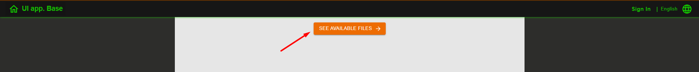
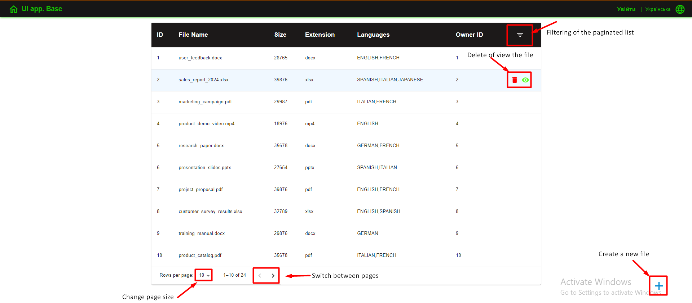
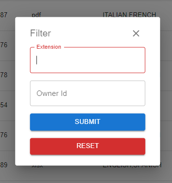
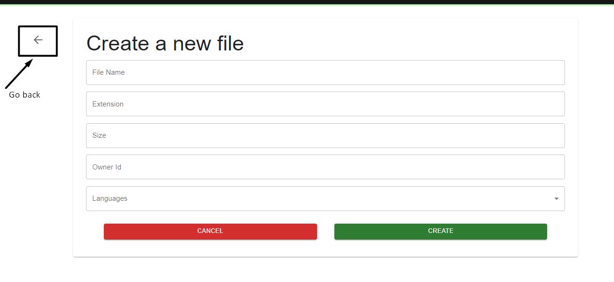
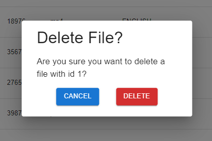
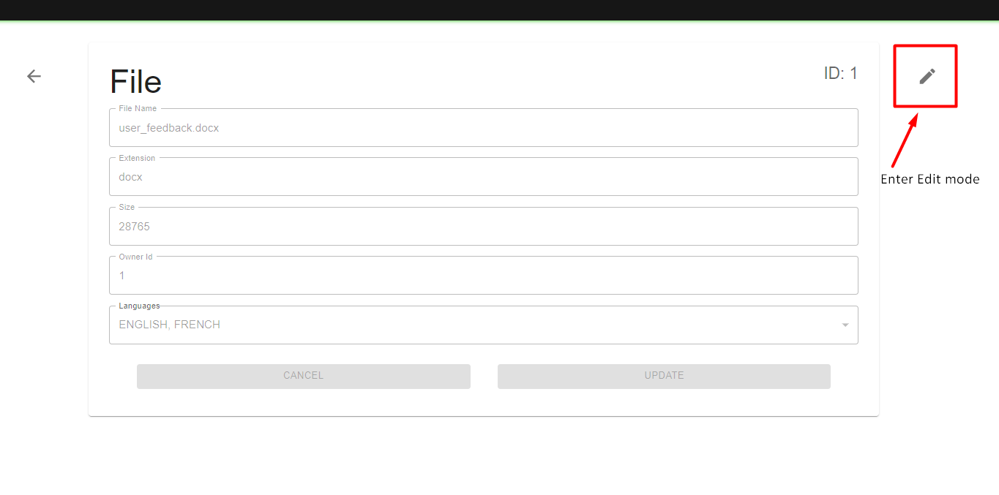
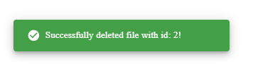
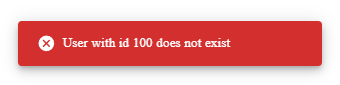

# Application Upgrade Introduction

#### Caution! Before testing the application make sure you:
- Pulled all the backend changes on your local machine
- Started the server at port 8080

#### Have fun! Let's dive in.

### To start using the "extra" part of the application all you need is to press the button located on the default page:

### After clicking the button you will be transferred to a page, that contains a table with pagination and filtering and some other functionality described on the picture below:

### By clicking a button in the top-right corner of the table you will be shown a filter modal where you can define your filter properties. The modal is represented with the help of a form that has validation and a Reset button to reset all the filter props. An example is shown below:

### In the bottom-right corner of the page you may see a plus button that will direct you to the "Create" page where you can create a new File like this:

- This page is already in modification mode so pay attention!
- By pressing the Cancel buttons you will reset input values and errors.
- By pressing the Create button you will create a new File entity if given information previously passed validation. Otherwise, validation errors will be shown.

### If you click Delete button that every file line in the table has, you will see the confirmation modal window before the action is executed. By clicking the Cancel button you will hide the modal and cancel the operation.

### When you click View button in a specific file row you will be directed to View or Edit page where you can review or modify your files.

- When yu enter the page you are in the "ViewOnly" mode.
- To enter Modification mode press a button in the top-right corner.
- By pressing a Cancel button you will reset all the changes and enter ViewOnly mode.
- Before pressing Update amke sure all your data passes the validation)

### After each operation you will be notified with a snackbar in the bottom-left corner with a particular operation status message. Like this:

### The application is not afraid of page reloads, all application state is preserved.

